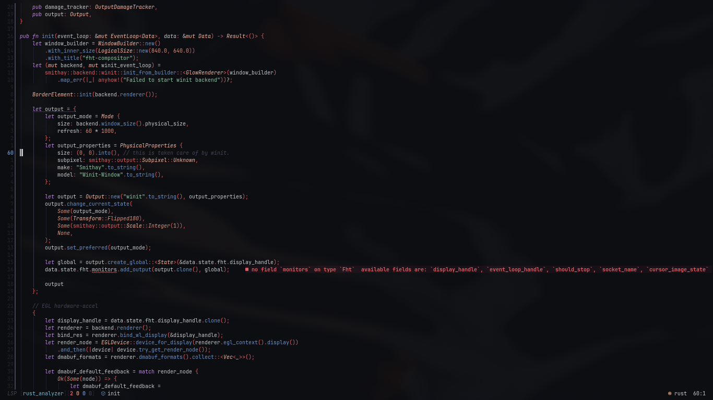
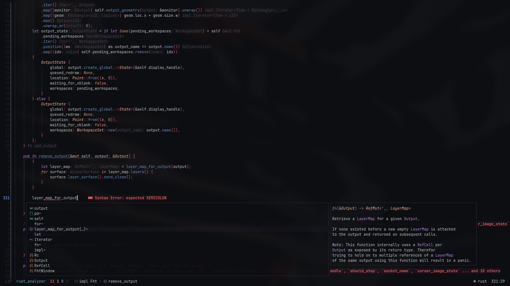
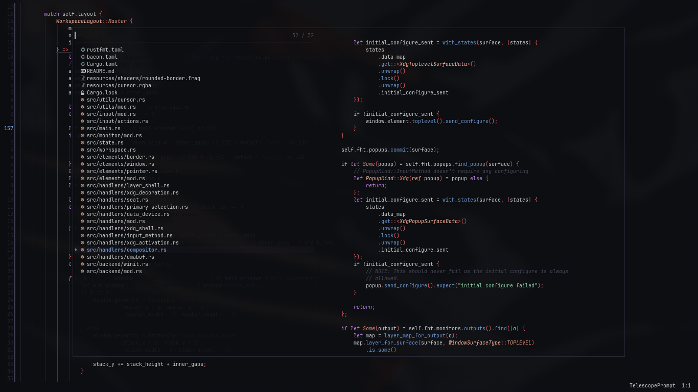
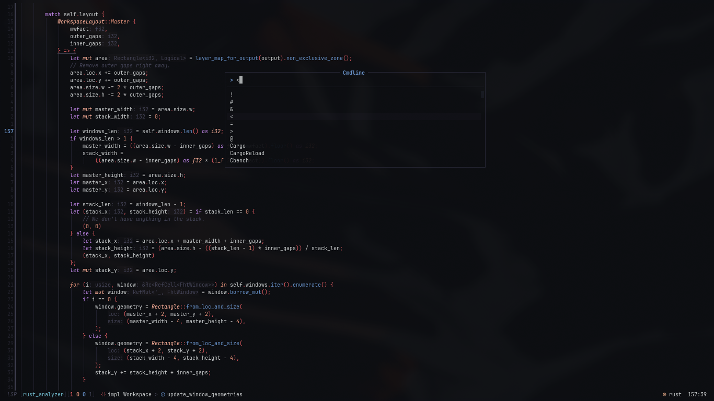
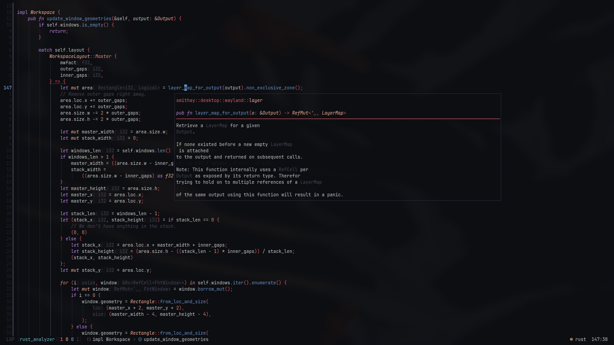
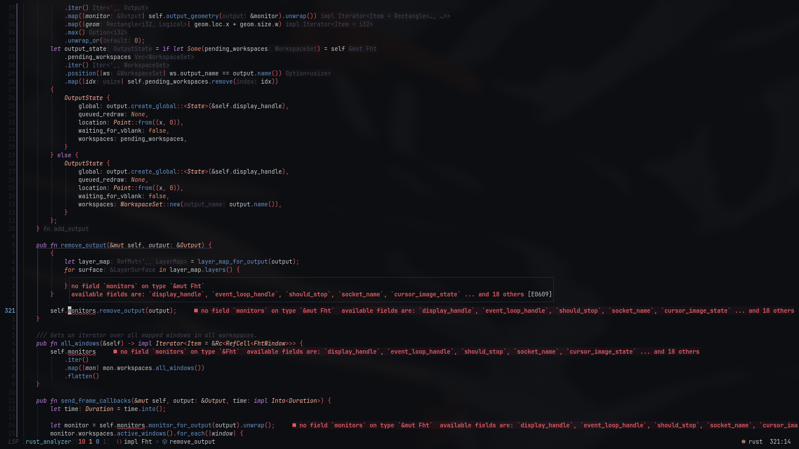

# nferhat's neovim

This is my custom extremely well tailored neovim configuration. This is the fruit of a 2 year long journey perferting the art of my workflow to satisfy my needs. I am releasing this apart since some people asked me for my neovim configuration when i sent them screenshots one day, hence this is only one part of my workflow.

## Contents

- Simple configuration layout that is very suitable as a base for beginner configurations.
- Extremely fast configuration, loads in `20ms~50ms`.
- Custom colorscheme engine that compiles down everything to bytecode and supports hot-reloding of your scheme.  (See `lua/ui/theme`)
- Custom statusline (See `lua/ui/statusline`)
- 32 plugins for diverse usages, such as the basics of an editor, UI enhancements, tools, etc.

## Setup

- Backup your old `~/.config/nvim` if you have any.
- Git clone this repo into the said path above.
- Run neovim.

## Screenshots

## Acknowledgements

- The neovim team for providing this beast of an editor, and the plugin developers for enhancing it.
- @siduck, since I copied from him: the theme bytecode compiler, the custom LSP rename prompt (`lua/ui/renamer.lua`)
